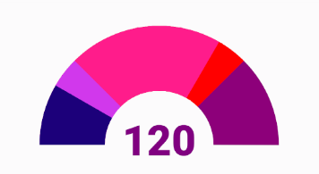
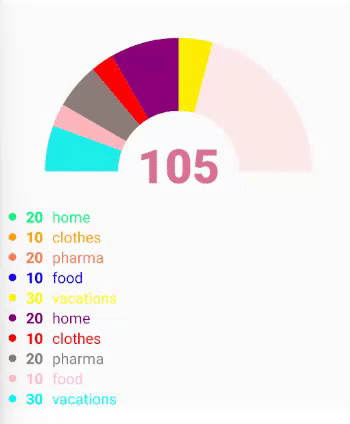
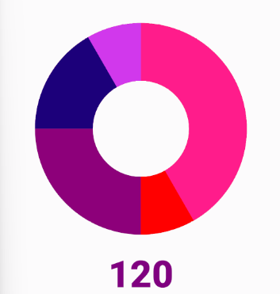
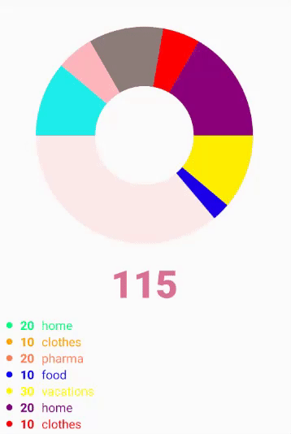

# RN-Animated-Donut-Chart is a dynamic donut chart with an infinit numbers of categories and can be used as a half and full donut chart.

### It comes with a built-in TypeScript typings and is compatible with all popular JavaScript frameworks including React , Vue , Svelte , and Angular . You can use RN-Animated-Donut-Chart directly or leverage well-maintained wrapper packages that allow for a more native integration with your frameworks of choice.

# Semi circular donut chart:

# Full circular donut chart:

| Name                  | Type         | Default                 |
| --------------------- | ------------ | ----------------------- |
| precentegs            | Precentage[] | []                      |
| radius                | number       | 200                     |
| strokeWidth           | number       | 150                     |
| duration              | number       | 500                     |
| backColor             | string       | "tomato"                |
| textColor             | string       | "black"                 |
| strokeLinecap         | string       | "none"                  |
| rotation              | number       | 180                     |
| isCemiCircle          | boolean      | true                    |
| isShowDescription     | boolean      | false                   |
| isShowTotalValue      | boolean      | true                    |
| totalValueStyle       | TextStyle    | null                    |
| textDescriptionStyle  | TextStyle    | null                    |
| valueDescriptionStyle | TextStyle    | null                    |
| dotDescriptionStyle   | TextStyle    | null                    |
| easing                | any          | Easing.out(Easing.ease) |
